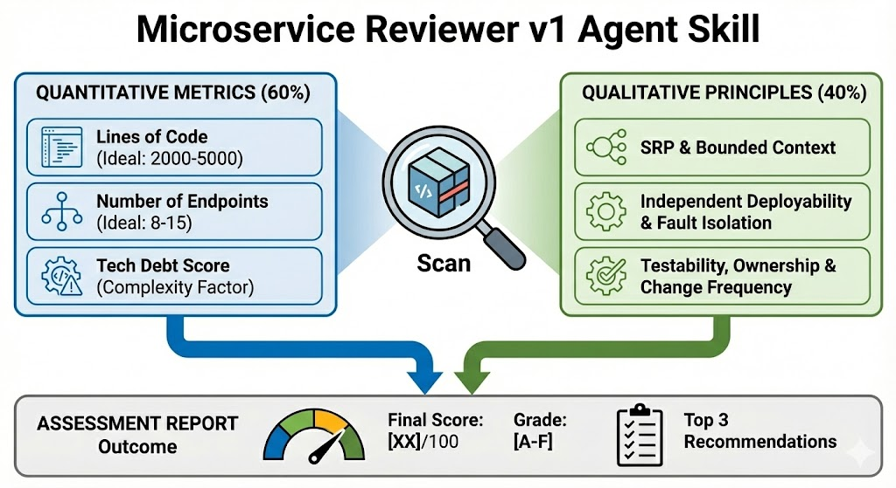

# Microservice Reviewer

> Simple microservice assessment tool for startup engineering teams

## 🎯 Problem Statement

Early-stage startups face a common challenge:
- Junior engineers lack microservice architecture experience
- Senior engineers don't have time for thorough code reviews
- No standardized criteria for evaluating service quality
- Technical debt accumulates silently without visibility

**This skill solves these problems** by providing an automated, objective assessment framework that educates teams while saving time.



## 👥 Who This Is For

### Perfect for:
- **Startup Engineering Teams** (5-50 engineers)
- **Junior Developers** learning microservice patterns
- **Tech Leads** needing objective quality metrics
- **CTOs** tracking technical debt across services

### Not ideal for:
- Large enterprises with established architecture teams
- Solo developers (overkill for single-person projects)
- Monolithic applications

## 📊 What It Does

Evaluates microservices on a 100-point scale across:

**Quantitative Metrics (60%)**
- Lines of Code: 2,000-5,000 ideal
- API Endpoints: 8-15 ideal
- Tech Debt Score: Formula-based

**Qualitative Principles (40%)**
- Single Responsibility
- Independent Deployability
- Testability
- Team Ownership
- Change Frequency
- Bounded Context
- Fault Isolation

**Output:** Letter grade (A-F) + actionable recommendations

## 🚀 How to Use

### Installation

1. Download `microservice-reviewer-v1.skill`
2. Open Claude.ai → Settings → Skills
3. Click "Upload Skill"
4. Select the downloaded file
5. Done! ✅

### Usage

**Option 1: Quick Assessment**
```
"Review my user-service:
- 3500 lines of code
- 12 endpoints
- Moderate complexity
- 65% test coverage
- Platform team owns it"
```

**Option 2: Provide Metadata**
```json
{
  "service_name": "payment-service",
  "lines_of_code": 3200,
  "num_endpoints": 10,
  "complexity": "moderate",
  "test_coverage": 60,
  "deploys_independently": true
}
```

**Option 3: Paste Code**
Just paste your service code and ask Claude to review it.

### Example Output
```
=== MICROSERVICE ASSESSMENT ===

Service: payment-processor
Grade: B (77/100)

Quantitative: 47/60
Qualitative: 30/40

Top 3 Recommendations:
1. Add circuit breakers
2. Reduce change frequency
3. Extract notification logic
```

## 📈 Grading Scale

| Grade | Score | Meaning |
|-------|-------|---------|
| A | 85-100 | Excellent - Production ready |
| B | 70-84 | Good - Minor improvements |
| C | 55-69 | Acceptable - Needs work |
| D | 40-54 | Poor - Major refactoring |
| F | 0-39 | Critical - Redesign needed |

## 💡 Tips for Best Results

1. **Be honest** with metrics - garbage in, garbage out
2. **Focus on Grade B+** - don't chase perfection early
3. **Run monthly** - track improvements over time
4. **Use for learning** - discuss WHY principles matter
5. **Context matters** - adjust expectations for your stage

## 🔄 Version History

**v1.0 (Current)**
- ✅ Manual assessment with user-provided data
- ✅ 10 key metrics (3 quantitative, 7 qualitative)
- ✅ 100-point scoring system
- ✅ Letter grades A-F

**v2.0 (Planned)**
- 📋 Automated code analysis
- 📋 Language-specific parsers
- 📋 Dependency detection

**v3.0 (Future)**
- 📋 Custom threshold configuration
- 📋 Team benchmarking
- 📋 Trend tracking over time

## 🤝 Contributing

Found a bug? Have a suggestion? 

1. Open an issue describing the problem
2. Submit a PR with improvements
3. Share your use case in discussions

## 📄 License

MIT License - Free to use and modify

## 🙏 Acknowledgments

Built using [Claude AI Skills framework](https://claude.ai/skills)

Inspired by real pain points in startup engineering teams.

---

**Questions?** Open an issue or start a discussion!
